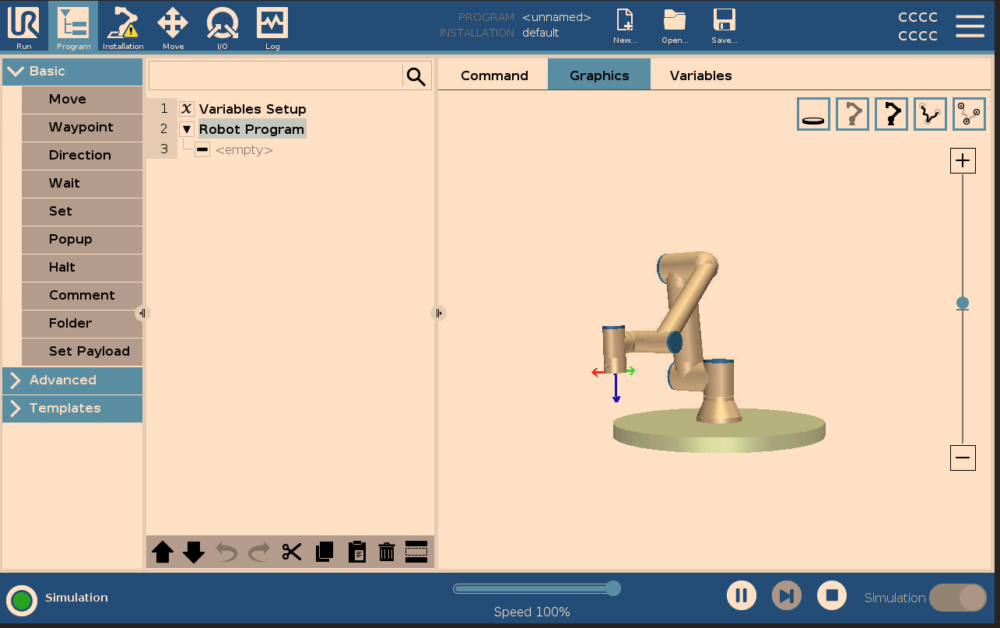

# UR Robot Controller

[](https://www.python.org/downloads/)
[](https://opensource.org/licenses/MIT)
[](https://sdurobotics.gitlab.io/ur_rtde/)

A comprehensive Python library for controlling Universal Robots (UR) arms through Real-Time Data Exchange (RTDE). Supports both simulation environments and physical robots with built-in safety features.



## What This Project Does

This library lets you **control Universal Robots** (6-axis robot arms) using Python code. You are given 4 example scripts:

- **Set (synchronous) pose movements**: Make the robot move to specific positions executed until all the positions are exhausted.
- **Asynchronous (continuous) poses**: Make the robot move to a new position as the jsonl file is continuously updated.
- **Syncronous delta movements**: Make therobot move specific distances from its current point until all movements are exhausted.
- **Asynchronous delta movements**: Make the robot subsribe to the jsonl file continuously and move as commands enter. 
- **Library customisation**: Allowing you to build many more scripts to meet your robot operational configurations
- **Work with simulation**: Practice and test your code safely using a virtual robot


---

## Installation

### System Requirements
- **Python**: 3.8 or higher
- **Operating System**: Linux (Ubuntu 20.04+), Windows 10/11, macOS 10.15+
- **Robot Hardware**: Universal Robots e-Series (UR3e, UR5e, UR10e, UR16e, UR20) if using physical robots
- **Network**: Ethernet connection to robot (for physical robots)
- **Docker**: Required for simulation mode

### Environment Setup
```bash
# Clone the repository
git clone https://github.com/erolcem/ursim_pipeline.git
cd ursim_pipeline

# Create and activate virtual environment
python3 -m venv ur_venv
source ur_venv/bin/activate  # On Windows: ur_venv\Scripts\activate

# Install dependencies
pip install -r requirements.txt
```

---

##  Configuration: Setup Your Robot Settings

**IMPORTANT**: Set up your robot configuration first. This makes all scripts work without extra arguments.

### Create Your Robot Configuration

Copy the template and customize it for your setup:
```bash
# Copy template to create your config
cp config/robot_config_template.yaml config/my_robot.yaml

# Edit with your settings
nano config/my_robot.yaml  # or use any text editor
```

### Configuration Examples

**For Simulation (Default):**
```yaml
robot:
  type: "simulation"
  ip: "127.0.0.1"
  model: "UR5e"
  frequency: 500.0

movement:
  default_speed: 0.1
  default_acceleration: 0.3

logging:
  level: "INFO"
```

**For Physical Robot:**
```yaml
robot:
  type: "physical"
  ip: "192.168.1.100"  # Your robot's IP address
  model: "UR10e"       # Your robot model
  frequency: 500.0

physical:
  safety:
    max_velocity: 0.2        # Slower for safety
    max_acceleration: 0.5    # Gentle acceleration
    workspace_limits:        # Define safe workspace
      x: [-0.8, 0.8]        # X limits in meters
      y: [-0.8, 0.8]        # Y limits in meters  
      z: [0.1, 1.5]         # Z limits in meters

movement:
  default_speed: 0.05       # Start slow for physical robots!
  default_acceleration: 0.1

logging:
  level: "INFO"
```

### Using Your Configuration

Once you have `config/my_robot.yaml`, all scripts will use it by default:
```bash
# All these commands will use your config/my_robot.yaml automatically
python examples/basic_example.py
python examples/synchronous_control.py --json-source examples/synchronous_deltas.jsonl
python examples/asynchronous_control.py --json-file examples/asynchronous_deltas.jsonl
```

**Thus no specifying `--robot-ip` or `--robot-type` every time**

---

## Simulation Setup

### Start the Virtual Robot
```bash
# Install Docker Desktop from https://docker.com first
# Then start the UR simulator
./scripts/startDocker.sh
```

### Configure the Simulator (One-time setup)
1. Open simulator web interface: http://localhost:6080/vnc.html
2. Complete the setup:
   - Click "Confirm Safety Configuration"
   - Turn ON "Simulation" switch (bottom right)
   - Go to Program → Graphics
   - Go to Move → Press "ON" → Press "START"
   - Return to Program → Graphics

**Keep this simulator window open!** 

### Test Simulation
```bash
# In a new terminal (keep simulator running)
source ur_venv/bin/activate

# Quick connection test
python scripts/check_robot_status.py

# Visual movement test (watch robot move in simulator)
python scripts/visual_test.py
```

---

## Physical Robot Setup

### Hardware Requirements
- UR robot (UR3e, UR5e, UR10e, UR16e, or UR20)
- Ethernet cable
- Computer connected to same network as robot
- Robot powered on and safety configured

### Physical Connection Options

**Option A: Direct Connection**
1. Connect ethernet cable directly from computer to robot
2. Set computer's IP to `192.168.1.XXX` (where XXX is 1-254, but not 100)
3. Robot will typically be at `192.168.1.100`

**Option B: Network Connection (UNVERIFIED)**
1. Connect robot to your local network via ethernet
2. Robot gets IP from your router (check robot's teach pendant for IP)
3. Computer must be on same network

### Robot Configuration (On Teach Pendant)

**Configure Network:**
1. Go to **Settings** → **System** → **Network**
2. Note the IP address (e.g., `192.168.1.100`)

**Install External Control:**
1. Go to **Settings** → **Features** → **External Control**
2. Install **External Control URCap** if not already installed

**Create Control Program:**
1. Create a simple program:
   ```
   
   Robot Program:
   1. External Control (<pc ethernet id>, 50002) 
   ```
2. Save as "External_Control"
3. Load and run this program

### Find and Test Your Robot

```bash
# Find robots on your network
python scripts/setup_physical_robot.py --scan

# Test connection to specific robot
python scripts/setup_physical_robot.py --test-ip 192.168.1.100
```

### Update Your Configuration

Edit `config/my_robot.yaml` with your robot's IP:
```yaml
robot:
  type: "physical"
  ip: "192.168.1.100"  # Your robot's actual IP
  # ... rest of physical robot config
```

### Step 1: Network Configuration
```bash
# Verify your computer's IP
ip route get 192.168.1.5 | grep -oP 'src \K\S+'
# Should return: 192.168.1.155 (or your computer's IP)
```

### Step 2: Robot Configuration (Critical Settings)
**On Robot Teach Pendant:**

1. **External Control URCap Settings:**
   - Host IP: `192.168.1.155` (your computer's IP)
   - Custom Port: `50002`
   - Host Name: `192.168.1.155` (MUST match Host IP - this was key!)

2. **Create External Control Program:**
   ```
   Program Structure:
   └── External Control (192.168.1.155:50002)
   ```
   - **NO loops or waits** - just the External Control node alone
   - **NO additional commands**

### Step 3: The Working Execution Sequence

**CRITICAL ORDER - This sequence is what made it work:**

1. **Start Python script FIRST:**
   ```bash
   cd /home/erolc/Projects/ursim_pipeline
   source ur_venv/bin/activate
   python scripts/test_simple_movement.py

### The Process (CONFIRMED WORKING)
```bash
# Step 1: Put robot in REMOTE mode (on teach pendant)

# Step 2: Run Python script
source ur_venv/bin/activate && python scripts/test_simple_movement.py

# Step 3: External Control automatically activates!
# ✅ Robot moves
# ✅ Connection stays active
# ✅ Ready for more scripts
```


## Testing Your Setup

### Test 1: Connection Status
```bash
source ur_venv/bin/activate
python scripts/check_robot_status.py
```
**Expected output:**
```
✅ Connection successful!
🤖 Robot Mode: ROBOT_MODE_RUNNING (7)
🛡️ Safety Mode: NORMAL (1)
📍 TCP Pose: [-0.144, -0.436, 0.202, ...]
✅ Robot is ready for control!
```

### Test 2: Visual Movement
```bash
python scripts/visual_test.py
```
**What happens:** Robot moves slowly - watch it in simulator interface or observe physical robot

### Test 3: Basic Control
```bash
python examples/basic_example.py
```
**What it tests:** Connection, position reading, linear movements, velocity control

**All tests use your `config/my_robot.yaml` automatically!**

---

## 🔧 Using the Scripts

All scripts work with both simulation and physical robots. They automatically use `config/my_robot.yaml` if it exists.

### 🎮 Basic Control Examples

**Basic robot control and movements:**
```bash
python examples/basic_example.py
```
**What it does:** Connects, gets position, performs linear movements, velocity control, disconnects
**Works with:** Both simulation and physical robots

### 📁 Command File Execution

**Sequential command execution (step-by-step):**
```bash
python examples/synchronous_control.py --json-source examples/synchronous_deltas.jsonl
```
**What it does:** Reads commands from file, executes each one, waits for completion before next
**Works with:** Both simulation and physical robots
**Command format:** One movement per line in JSONL format

**Continuous command streaming (real-time):**
```bash
python examples/asynchronous_control.py --json-file examples/asynchronous_deltas.jsonl
```
**What it does:** Continuously reads latest command from file and applies it as velocity
**Works with:** Both simulation and physical robots
**Use case:** Real-time control, game controllers, continuous path following

### 🛠️ Diagnostic and Setup Tools

**Check robot status and connection:**
```bash
python scripts/check_robot_status.py
```
**What it shows:** Connection status, robot mode, safety status, current position

**Visual movement test:**
```bash
python scripts/visual_test.py  
```
**What it does:** Slow, visible movements for verification - watch in simulator or physical robot

**Find physical robots on network:**
```bash
python scripts/setup_physical_robot.py --scan
```
**What it shows:** IP addresses of UR robots found on your network

**Test specific robot connection:**
```bash
python scripts/setup_physical_robot.py --test-ip 192.168.1.100
```
**What it tests:** Whether you can connect to robot at that IP address

**Start robot simulator:**
```bash
./scripts/startDocker.sh
```
**What it does:** Downloads and starts UR simulator in Docker container

### 📂 Legacy Scripts (Your Original Working Examples)

**Original working examples (preserved for reference):**
```bash
python legacy/ur_example.py          # Basic UR robot examples
python legacy/ur_synchronous.py      # Sequential command execution  
python legacy/ur_asynchronous.py     # Streaming command execution
```

---

## 📋 Command File Format

Create movement sequences in JSONL format (one JSON object per line):

**Example `my_movements.jsonl`:**
```json
{"dx": 0.05, "dy": 0.0, "dz": 0.0}
{"dx": 0.0, "dy": 0.05, "dz": 0.0}  
{"dx": 0.0, "dy": 0.0, "dz": 0.05}
{"dx": 0.0, "dy": 0.0, "dz": 0.0, "drx": 0.1}
```

**What each field means:**
- `dx, dy, dz`: Move in X, Y, Z directions (in meters)
- `drx, dry, drz`: Rotate around X, Y, Z axes (in radians)

**Execute your movements:**
```bash
# Sequential execution (waits for each movement to complete)
python examples/synchronous_control.py --json-source my_movements.jsonl

# Streaming execution (continuous control)
python examples/asynchronous_control.py --json-file my_movements.jsonl
```

**Both work with simulation and physical robots using your config file!**

---

## 💡 Writing Your Own Robot Code

### Understanding the Library Files

**`src/ur_controller.py`** - This is the main library file that:
- Handles all communication with UR robots (simulation and physical)
- Provides safety checks and error handling
- Offers simple functions like `move_linear()`, `get_tcp_pose()`, etc.
- You import this in your own Python programs

**How to use it in your own code:**

```python
# Import the library
from src.ur_controller import URRobotController

# Create robot controller (uses config/my_robot.yaml automatically)
robot = URRobotController(config_path="config/my_robot.yaml")

# Connect to robot
if robot.connect():
    print("Robot connected!")
    
    # Get current position
    current_position = robot.get_tcp_pose()
    print(f"Robot is at: {current_position}")
    
    # Move robot 10cm to the right
    robot.move_linear_relative([0.1, 0, 0], speed=0.1)
    
    # Apply velocity for 2 seconds
    robot.move_velocity([0.05, 0, 0, 0, 0, 0], duration=2.0)
    
    robot.disconnect()
else:
    print("Could not connect to robot")
```

### More Advanced Example

```python
from src.ur_controller import URRobotController, URCommandProcessor
import time

# Initialize with your config
robot = URRobotController(config_path="config/my_robot.yaml")

if robot.connect():
    # Move in a square pattern
    square_moves = [
        [0.1, 0, 0],    # Right 10cm
        [0, 0.1, 0],    # Forward 10cm  
        [-0.1, 0, 0],   # Left 10cm
        [0, -0.1, 0]    # Back 10cm
    ]
    
    for move in square_moves:
        robot.move_linear_relative(move, speed=0.05)
        time.sleep(1)  # Pause between moves
    
    robot.disconnect()
```

**Why use this approach?** The library handles all the complex robot communication, safety checks, and error handling, so you can focus on what you want the robot to do!

---

## 🛠️ Project Structure Explained

### 📁 What Each File/Folder Does

```
ursim_pipeline/
├── 📂 src/
│   └── ur_controller.py              # Main library - handles all robot communication
├── 📂 examples/                      # Ready-to-run example scripts
│   ├── basic_example.py              # ➤ python examples/basic_example.py
│   ├── synchronous_control.py        # ➤ python examples/synchronous_control.py --json-source file.jsonl
│   ├── asynchronous_control.py       # ➤ python examples/asynchronous_control.py --json-file file.jsonl
│   ├── synchronous_deltas.jsonl      # Example movement commands (step-by-step)
│   └── asynchronous_deltas.jsonl     # Example movement commands (continuous)
├── 📂 scripts/                       # Utility tools for setup and diagnostics
│   ├── startDocker.sh                # ➤ ./scripts/startDocker.sh
│   ├── setup_physical_robot.py       # ➤ python scripts/setup_physical_robot.py --scan
│   ├── check_robot_status.py         # ➤ python scripts/check_robot_status.py
│   └── visual_test.py                # ➤ python scripts/visual_test.py
├── 📂 config/
│   └── robot_config_template.yaml    # Template - copy this to create your config
├── 📂 legacy/                        # Your original working scripts (preserved)
│   ├── ur_example.py                 # ➤ python legacy/ur_example.py
│   ├── ur_synchronous.py             # ➤ python legacy/ur_synchronous.py  
│   └── ur_asynchronous.py            # ➤ python legacy/ur_asynchronous.py
├── 📂 docs/
│   └── Documentation_Arm_simulationv1.pdf  # Visual simulator setup guide
├── requirements.txt                  # Python packages needed
├── setup.py                         # Makes this a proper Python package (optional)
├── .gitignore                       # Git ignore rules
├── LICENSE                          # MIT license
└── README.md                        # This guide
```

### Key Files Explained

**`src/ur_controller.py`** - The main library that does all the work:
- Communicates with robots using RTDE protocol
- Handles safety checks for physical robots
- Provides simple functions like `move_linear()`, `get_tcp_pose()`
- You import this in your own Python programs

**`config/robot_config_template.yaml`** - Settings template:
- Copy this to create your own robot configuration
- Stores robot IP, type (simulation/physical), safety limits
- Makes all scripts work without extra command line arguments

**`setup.py`** - Package installer (advanced users only):
- Makes this into a proper Python package
- Optional - you can use everything without it
- Run `pip install -e .` to install system-wide

---

## 🛡️ Safety Features

### Physical Robot Safety
- ✅ Configurable velocity and acceleration limits in config file
- ✅ Workspace boundary checking prevents dangerous movements
- ✅ Emergency stop functionality
- ✅ Connection verification before any movement
- ✅ Conservative default parameters
- ✅ Robot mode and safety status validation

### Simulation Safety
- ✅ Automatic connection validation
- ✅ Error handling and recovery
- ✅ Comprehensive logging
- ✅ Non-destructive testing environment

---

## 📊 Supported Robot Models

| Model | Payload | Reach | Status | Tested |
|-------|---------|-------|--------|--------|
| UR3e  | 3 kg    | 500 mm | ✅ Supported | ✅ |
| UR5e  | 5 kg    | 850 mm | ✅ Supported | ✅ |
| UR10e | 10 kg   | 1300 mm | ✅ Supported | ✅ |
| UR16e | 16 kg   | 900 mm | ✅ Supported | ⚠️ |
| UR20  | 20 kg   | 1750 mm | ✅ Supported | ⚠️ |

*⚠️ = Supported but not physically tested*

---

## 🔧 Troubleshooting

### Connection Issues
```bash
# Check robot status first
python scripts/check_robot_status.py
```

**Common solutions:**
- Verify robot IP in config file
- Check network connectivity: `ping 192.168.1.100`
- For simulation: verify Docker container running: `docker ps | grep ursim`
- For physical robots: ensure robot is in Remote Control mode

### Movement Issues
- Check safety limits in config file
- Verify workspace boundaries
- Ensure robot program is running (physical robots)
- Check emergency stop status

### File Issues
```bash
# Recreate virtual environment if needed
rm -rf ur_venv
python3 -m venv ur_venv
source ur_venv/bin/activate
pip install -r requirements.txt
```

---

## 🚀 Future Development: ROS 2 Integration

This project is designed as foundation for ROS 2 integration:

- 🔄 ROS 2 nodes for robot control
- 🤖 MoveIt integration for motion planning
- 📡 tf2 transforms for coordinate frames
- 📋 Standard ROS 2 interfaces (action servers, services)
- 🚀 Launch files for easy deployment
- 📊 RViz visualization support

---

## 🤝 Contributing

1. **Fork** the repository
2. **Create** a feature branch (`git checkout -b feature/amazing-feature`)
3. **Commit** your changes (`git commit -m 'Add amazing feature'`)
4. **Push** to the branch (`git push origin feature/amazing-feature`)
5. **Open** a Pull Request

---

## 📄 License

This project is licensed under the MIT License - see the [LICENSE](LICENSE) file for details.

## 🙏 Acknowledgments

- **Universal Robots** for the RTDE interface and URSim simulator
- **SDU Robotics** for the excellent `ur_rtde` Python library
- **The UR robotics community** for documentation and examples

## 📞 Support

- 📖 **Documentation**: Check this README and run the examples
- 🐛 **Issues**: [Open an issue](https://github.com/erolcem/ursim_pipeline/issues)
- 💬 **Discussions**: [GitHub Discussions](https://github.com/erolcem/ursim_pipeline/discussions)

---

<div align="center">

**⭐ Star this repository if it helped you! ⭐**

[🔗 View on GitHub](https://github.com/erolcem/ursim_pipeline) | [📋 Report Bug](https://github.com/erolcem/ursim_pipeline/issues) | [💡 Request Feature](https://github.com/erolcem/ursim_pipeline/issues)

</div>
